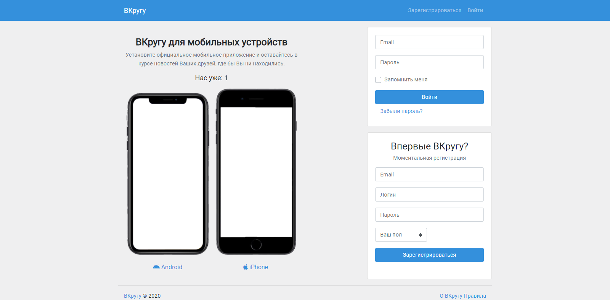
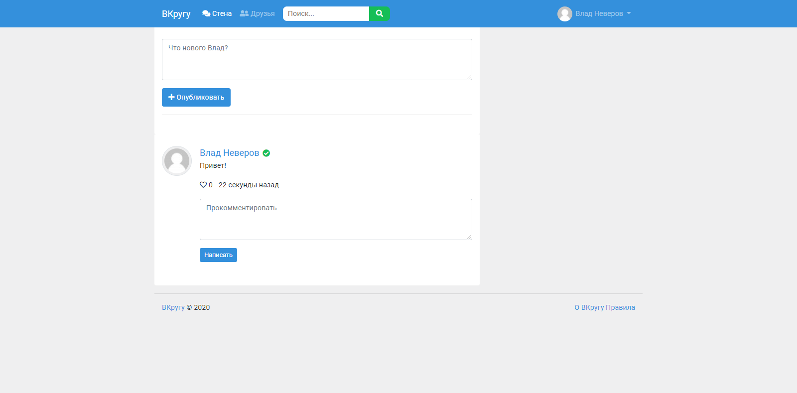

# Laravel 8 - Social Network

A small social network on Laravel.




## Install
cd project
`composer install` (see folder **vendor**)

cd project
`npm install` (see folder **node_modules**)

clone `.env.example` and rename to `.env`

Generate APP_KEY
`php artisan key:generate`

## Connection to DataBase `.env`
```
DB_CONNECTION=mysql
DB_HOST=localhost
DB_PORT=3306
DB_DATABASE=your db name
DB_USERNAME=your username
DB_PASSWORD=your password
```

## Running Migrations
```
php artisan migrate
php artisan db:seed
```

## Connection to Mailtrap `.env`
```
MAIL_DRIVER=smtp
MAIL_HOST=smtp.mailtrap.io
MAIL_PORT=2525
MAIL_USERNAME=your username
MAIL_PASSWORD=your password
MAIL_ENCRYPTION=null
MAIL_FROM_ADDRESS=social-network@gmail.com
MAIL_FROM_NAME="${APP_NAME}"
```

## Login
admin@gmail.com
admin123